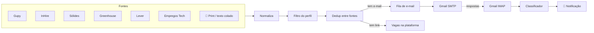

# 🎯 Hunter — agente de busca e candidatura a vagas

Um agente que roda no seu computador e cuida da parte repetitiva da procura de emprego em tecnologia:
**encontra vagas em várias plataformas, filtra pelo seu perfil, escreve a candidatura, envia pelo seu Gmail
e acompanha as respostas** — avisando quando chega um convite para entrevista.

Sem LLM pago, sem servidor, sem mensalidade: Node.js puro, sem dependências de npm.

> Construído durante a minha própria recolocação: ele buscava vagas de React/TypeScript remotas no
> Brasil de hora em hora enquanto eu me candidatava.

---

## O que ele faz

| | |
|---|---|
| 🔎 **Busca em 6 fontes** | Gupy, InHire, Sólides, Greenhouse, Lever e Empregos Tech — a cada hora, sozinho |
| 🧠 **Filtra pelo seu perfil** | Sua stack, diferenciais, níveis a excluir, remoto e cidades aceitas para híbrido — tudo em um JSON |
| 🧹 **Remove duplicatas** | A mesma vaga vista em duas fontes (ex.: agregador + Gupy) vira uma só |
| 📸 **Captura por print** | Viu uma vaga num feed ou grupo? Cole o print (Ctrl+V): OCR no navegador lê a vaga, acha o e-mail ou o link |
| ✍️ **Escreve a candidatura** | Assunto e carta por vaga, usando só fatos do seu perfil que aparecem na vaga — nunca inventa experiência |
| 📧 **Envia pelo Gmail** | Com o currículo em anexo, intervalo entre envios e limite diário (seu e-mail não cai em spam) |
| 📬 **Lê as respostas** | Classifica os e-mails de recrutamento: 🟢 entrevista · 🟡 etapa pendente · 🔴 não seguiu · ⚪ confirmação |
| 🔔 **Avisa no Windows** | Notificação nativa quando chega entrevista ou etapa pendente — com o painel fechado |
| 🖥️ **Painel local** | Fila de e-mails editável, vagas por plataforma, respostas, descartadas (com "incluir mesmo assim") |



## Decisões de engenharia

- **Uma fonte = um adaptador.** Cada plataforma vira o mesmo formato de vaga (`src/sources/*`); o filtro, a
  deduplicação e o resto não sabem de onde a vaga veio. Adicionar uma fonte é escrever um arquivo.
- **Cada plataforma pelo caminho mais estável que ela oferece:** API pública oficial (Greenhouse, Lever),
  API usada pelas próprias páginas de carreira (Gupy, InHire), dados estruturados da página (Sólides —
  Next.js flight data; Empregos Tech — RSS + JSON-LD `JobPosting`).
- **Listas de empresas que crescem sozinhas.** InHire e Greenhouse não têm portal central; o agente descobre
  empresas novas pelos links que aparecem nas outras fontes e pelos remetentes dos e-mails de recrutamento.
- **Sem LLM, de propósito.** Classificação por regras e cartas montadas a partir do perfil: custo zero,
  resultado previsível e fácil de auditar. O perfil é a única fonte de verdade — a carta só cita
  tecnologias que estão nele **e** na vaga.
- **Zero dependências de npm.** Cliente SMTP e IMAP escritos com `node:tls`; notificação do Windows via
  PowerShell; OCR com Tesseract.js carregado no navegador.
- **Nada se perde:** o histórico de cada vaga (envio, destinatário, mensagem) sobrevive às atualizações da busca.

## Uso responsável

- **Não automatiza nenhuma rede social.** Vaga vista em feed entra só pelo que *você* traz: print ou texto colado.
- **Nunca adivinha e-mail.** Só escreve para endereços publicados na própria vaga.
- **Envio com calma:** intervalo aleatório entre e-mails, limite por rodada, e o envio em lote é sempre um clique seu.
- **Respeita as fontes:** requisições espaçadas, cache (páginas de vaga são baixadas uma vez) e só vagas públicas.
- **Seus dados ficam na sua máquina.** Perfil, currículo, e-mails e senhas nunca vão para o Git.

---

## Como usar

**Requisitos:** Node.js 20+ e uma conta Gmail. (Notificações e agendamento automático: Windows.)

```bash
git clone https://github.com/FlaviaMMartini/hunter-vagas.git
cd hunter-vagas
```

1. **Seu perfil** — copie `perfil/perfil.example.json` para `perfil/perfil.json`, preencha e coloque seu
   currículo em PDF na pasta `perfil/` (o caminho vai no campo `"cv"`).
2. **Senha de app do Gmail** — copie `.env.example` para `.env` e siga as instruções dentro dele.
3. **Rode:**

```bash
npm run painel     # painel em http://localhost:4321
npm run hunt       # busca vagas em todas as fontes (o botão "Buscar vagas agora" faz o mesmo)
```

4. **Automático (Windows, opcional)** — no Agendador de Tarefas, agende:
   - `scripts/buscar-vagas-oculto.vbs` — a cada 1 hora (busca de vagas);
   - `scripts/verificar-respostas-oculto.vbs` — a cada 10 minutos (respostas + notificações).

## Configurando o "cérebro" da busca

Tudo em `perfil/perfil.json`:

| Campo | Para que serve |
|---|---|
| `busca.stack` | A vaga precisa citar pelo menos um destes (ex.: `react`, `reactjs`) |
| `busca.ignorar` | Frases que **não** contam como a sua stack (ex.: `react native`) |
| `busca.diferenciais` | Somam pontos e aparecem na coluna "Extras" (ex.: `typescript`) |
| `busca.termos` | O que pesquisar nas plataformas que buscam por palavra (Gupy, Sólides) |
| `busca.remoto` / `busca.hibridoEm` | Aceita remoto e/ou híbrido só nessas cidades |
| `busca.niveisExcluidos` | Títulos com estes níveis são descartados (ex.: `júnior`, `estágio`) |
| `carta.*` | Sua apresentação, cargo padrão para o assunto, fechamento e despedida |
| `destaques[]` | Parágrafos da carta: `"sempre": true`, ou `"quando": [...]` palavras que, se aparecem na vaga, trazem o parágrafo |
| `genero` | `"feminino"` transforma "Desenvolvedor(a)" em "Desenvolvedora" no assunto |

## Estrutura

```
src/
  sources/        adaptadores: gupy, inhire, solides, greenhouse, ats (lever), empregostec
  profile.js      lê perfil.json e compila as regras de busca
  filter.js       aprova/descarta vagas (stack, nível, remoto, país, idade)
  hunt.js         orquestra a busca: fontes → filtro → dedup → banco local
  posts.js        captura manual: texto/print → vaga (acha e-mail, links, cargo)
  writer.js       assunto + carta por vaga, a partir do perfil
  mailer.js       cliente SMTP (Gmail) com anexo
  imap.js         cliente IMAP (Gmail): busca, estrutura MIME, decodificação
  responses.js    classifica respostas de recrutamento
  notify.js       notificação nativa do Windows
  server.js       API + painel local
public/index.html painel (HTML + JS puro, OCR com Tesseract.js)
```

## Licença

MIT — veja [LICENSE](LICENSE).

Feito por **Flavia Machado Martini** · [LinkedIn](https://www.linkedin.com/in/flaviamachadomartini/) · [GitHub](https://github.com/FlaviaMMartini)
