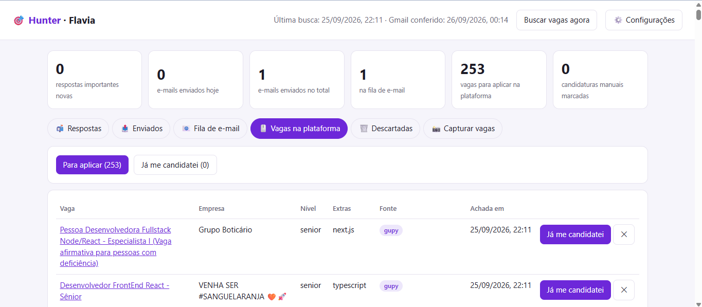
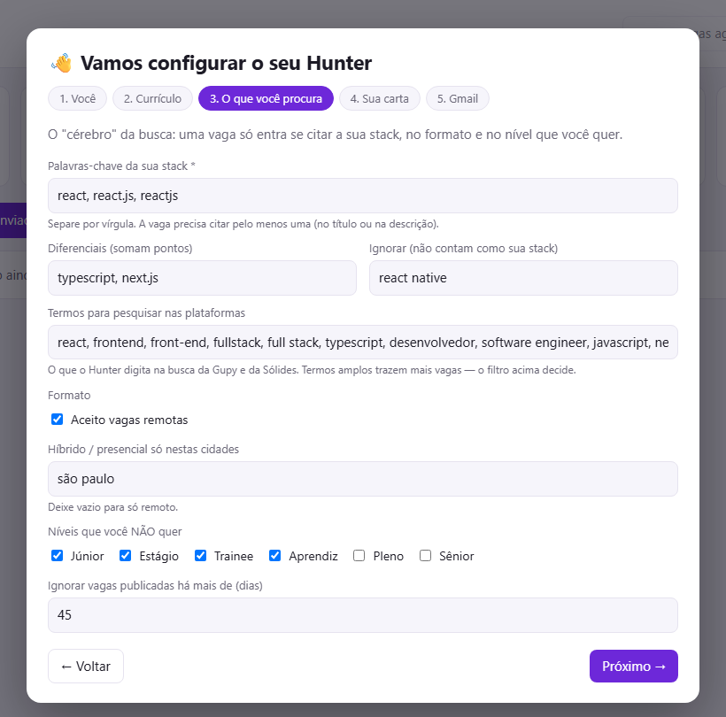
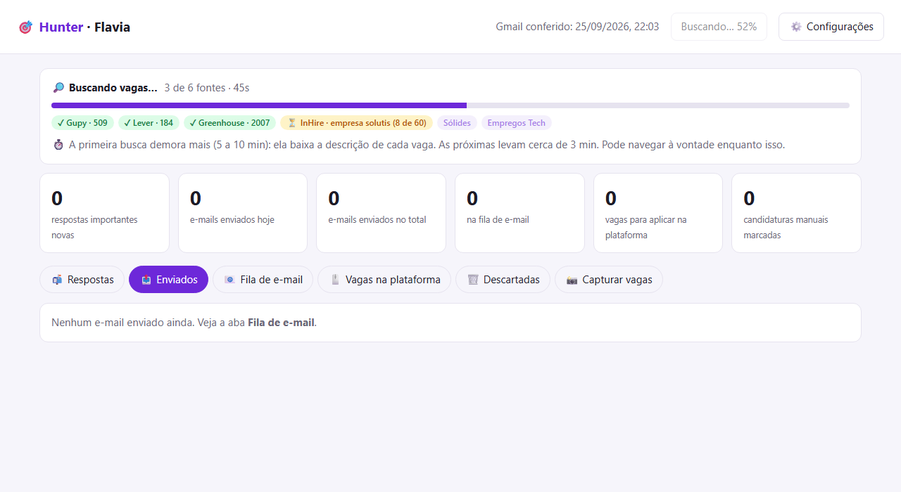
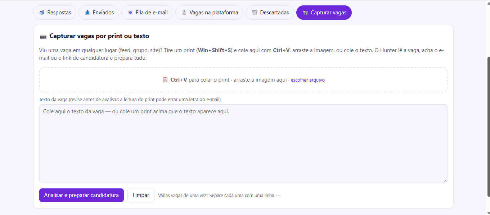
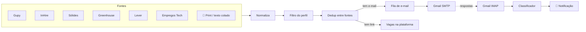

# 🎯 Hunter — agente de busca e candidatura a vagas

[](https://github.com/FlaviaMMartini/hunter-vagas/actions/workflows/ci.yml)


[](LICENSE)

Um agente que roda no seu computador e cuida da parte repetitiva da procura de emprego em tecnologia:
**encontra vagas em 6 plataformas, filtra pelo seu perfil, escreve cada candidatura, envia pelo seu Gmail
e acompanha as respostas** — avisando quando chega um convite para entrevista.

Sem LLM pago, sem servidor, sem mensalidade: Node.js puro, **zero dependências**, e seus dados nunca saem da sua máquina.

> Construído durante a minha própria recolocação: ele buscava vagas de React/TypeScript remotas no
> Brasil de hora em hora enquanto eu me candidatava.



## Começar em 1 minuto

**Requisito:** [Node.js 20+](https://nodejs.org) (confira com `node -v`).

```bash
git clone https://github.com/FlaviaMMartini/hunter-vagas.git
cd hunter-vagas
npm start
```

O painel abre no navegador e um **assistente** pede o que ele precisa: seus dados, o currículo em PDF,
as palavras-chave da sua stack, os textos da carta e a senha de app do Gmail (com botão de testar a conexão).
Ao salvar, a primeira busca já começa — com o progresso na tela.

<p align="center"></p>

**Deixar rodando sozinho (Windows):**

```bash
npm run agendar              # busca vagas a cada 1h + confere respostas no Gmail a cada 10 min
npm run agendar -- --painel  # (opcional) também sobe o painel ao entrar no Windows
npm run desagendar           # remove tudo
```

No Linux/macOS, `npm run agendar` mostra as linhas prontas para o `crontab`.

## O que ele faz

| | |
|---|---|
| 🔎 **Busca em 6 fontes** | Gupy, InHire, Sólides, Greenhouse, Lever e Empregos Tech — de hora em hora |
| 🧠 **Filtra pelo seu perfil** | Stack, diferenciais, níveis a excluir, remoto e cidades aceitas para híbrido |
| 🧹 **Remove duplicatas** | A mesma vaga vista em duas fontes (ex.: agregador + Gupy) vira uma só |
| 📸 **Captura por print** | Viu uma vaga num feed ou grupo? Cole o print (Ctrl+V): o OCR lê a vaga e acha o e-mail ou o link |
| ✍️ **Escreve a candidatura** | Assunto e carta por vaga, usando só fatos do seu perfil que aparecem na vaga — nunca inventa experiência |
| 📧 **Envia pelo Gmail** | Currículo anexo, intervalo aleatório entre envios, e o lote retoma sozinho se o PC reiniciar |
| 📬 **Lê as respostas** | 🟢 entrevista · 🟡 etapa pendente · 🔴 não seguiu · ⚪ confirmação — com lixeira em lote |
| 🔔 **Avisa no Windows** | Notificação nativa quando chega entrevista ou etapa pendente, mesmo com o painel fechado |

<table>
  <tr>
    <td></td>
    <td></td>
  </tr>
  <tr>
    <td align="center"><sub>Progresso da busca, fonte por fonte</sub></td>
    <td align="center"><sub>Captura por print (OCR) ou texto colado</sub></td>
  </tr>
</table>

## Como funciona



## Decisões de engenharia

- **Uma fonte = um adaptador.** Cada plataforma vira o mesmo formato de vaga (`src/sources/*`); filtro,
  deduplicação e cartas não sabem de onde a vaga veio. Adicionar uma fonte é escrever um arquivo
  ([como contribuir](CONTRIBUTING.md)).
- **Cada plataforma pelo caminho mais estável que ela oferece:** API pública oficial (Greenhouse, Lever),
  API usada pelas próprias páginas de carreira (Gupy, InHire), dados estruturados da página (Sólides —
  Next.js flight data; Empregos Tech — RSS + JSON-LD `JobPosting`).
- **Listas de empresas que crescem sozinhas.** InHire e Greenhouse não têm portal central; o agente descobre
  empresas pelos links vistos nas outras fontes e pelos remetentes dos e-mails de recrutamento.
- **Sem LLM, de propósito.** Classificação por regras e cartas montadas a partir do perfil: custo zero,
  resultado previsível e auditável. A carta só cita tecnologias que estão no perfil **e** na vaga.
- **Zero dependências.** Clientes SMTP e IMAP escritos com `node:tls`; notificação via PowerShell;
  OCR com Tesseract.js no navegador (o print é ampliado antes da leitura para acertar e-mails).
- **Resiliente.** Histórico de cada vaga preservado entre buscas, envio em lote salvo em disco,
  e quedas de conexão com o Gmail não derrubam o painel.

## Uso responsável

- **Não automatiza nenhuma rede social.** Vaga vista em feed entra só pelo que *você* traz: print ou texto colado.
- **Nunca adivinha e-mail.** Só escreve para endereços publicados na própria vaga.
- **Envio com calma:** intervalo aleatório entre e-mails, e o envio em lote é sempre um clique seu.
- **Respeita as fontes:** requisições espaçadas, cache (a página de cada vaga é baixada uma vez) e só vagas públicas.
- **Local-first:** perfil, currículo, e-mails e a senha de app ficam só no seu computador (`perfil/`, `data/`, `.env`, fora do Git).

## Configurando o "cérebro" da busca

Tudo pelo assistente (⚙️ Configurações) — ou direto em `perfil/perfil.json`:

| Campo | Para que serve |
|---|---|
| `busca.stack` | A vaga precisa citar pelo menos um destes (ex.: `react`, `reactjs`) |
| `busca.ignorar` | Frases que **não** contam como a sua stack (ex.: `react native`) |
| `busca.diferenciais` | Somam pontos e aparecem na coluna "Extras" (ex.: `typescript`) |
| `busca.termos` | O que pesquisar nas plataformas que buscam por palavra (Gupy, Sólides) |
| `busca.remoto` / `busca.hibridoEm` | Aceita remoto e/ou híbrido só nessas cidades |
| `busca.niveisExcluidos` | Títulos com estes níveis são descartados (ex.: `júnior`, `estágio`) |
| `carta.*` | Sua apresentação, cargo padrão para o assunto, fechamento e despedida |
| `destaques[]` | Parágrafos da carta: `"sempre": true`, ou `"quando": [...]` palavras que, se aparecem na vaga, trazem o parágrafo |

## Comandos

| Comando | O que faz |
|---|---|
| `npm start` | Abre o painel (e o navegador) |
| `npm run hunt` | Busca vagas pelo terminal |
| `npm run respostas` | Confere respostas no Gmail e notifica |
| `npm run agendar` / `desagendar` | Liga/desliga as rotinas automáticas (Windows) |
| `npm test` | Roda os testes |

## Problemas comuns

- **"A porta 4321 já está em uso"** — o painel já está aberto; acesse http://localhost:4321.
- **Gmail recusa o login** — use uma *senha de app* (não a sua senha normal), com a verificação em 2 etapas ativa.
- **Não aparece notificação** — confira se o "Não perturbe" do Windows está desligado.
- **A primeira busca demora** — é normal (5 a 10 min): ela baixa a descrição de cada vaga. As próximas levam ~3 min.

## Estrutura

```
src/
  sources/        adaptadores: gupy, inhire, solides, greenhouse, ats (lever), empregostec
  profile.js      lê perfil.json e compila as regras de busca
  filter.js       aprova/descarta vagas (stack, nível, remoto, país, idade)
  hunt.js         orquestra a busca: fontes → filtro → dedup → banco local (+ progresso)
  posts.js        captura manual: texto/print → vaga (acha e-mail, links, cargo)
  writer.js       assunto + carta por vaga, a partir do perfil
  mailer.js       cliente SMTP (Gmail) com anexo
  imap.js         cliente IMAP (Gmail): busca, estrutura MIME, decodificação
  responses.js    classifica respostas de recrutamento
  notify.js       notificação nativa do Windows
  schedule.js     agendamento no Agendador de Tarefas
  server.js       API + painel local
public/index.html painel (HTML + JS puro)
tests/            testes com node:test
```

## Contribuindo

Sugestões de fontes, correções e melhorias são bem-vindas — veja o [guia de contribuição](CONTRIBUTING.md).

## Licença

MIT — veja [LICENSE](LICENSE).

Feito por **Flavia Machado Martini** · [LinkedIn](https://www.linkedin.com/in/flaviamachadomartini/) · [GitHub](https://github.com/FlaviaMMartini)
